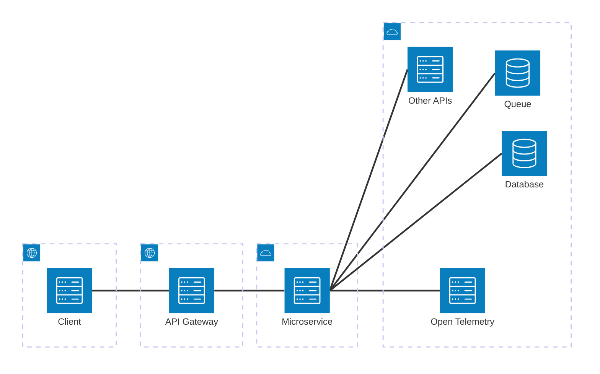

## Architecture

The Playground microservice is responsible for implementing the business logic of a single bounded context. It interacts with a polyglot set of dependencies, including databases, message queues, and external APIs.

Clients interact with the service via RESTful HTTP endpoints exposed through an API Gateway, which acts as the system’s single entry point. The microservice publishes domain events to message queues, enabling asynchronous communication with other services, and subscribes to events produced by external microservices.

Observability is achieved through OpenTelemetry, providing distributed tracing, metrics, and log correlation across all synchronous and asynchronous interactions.

To support scalability and performance, the microservice is deployed as two independently scalable hosts:
* An API Host, responsible for handling synchronous HTTP requests
* A Worker Host, responsible for background processing and event consumption

This architecture allows the system to handle high levels of concurrency and asynchronous workloads while maintaining reliability and operational visibility.

Follows well-established best practices:  

✅ Clear bounded context.  
✅ API Gateway as the single entry point.  
✅ Event-driven communication via queues.  
✅ Polyglot persistence (DB, Queue, external APIs).  
✅ OpenTelemetry for observability.  
✅ Separate API Host and Worker Host for scalability.  

Overall, this is a production-grade, cloud-native design.

1. Separation of concerns
* API Host
  - Handles synchronous HTTP requests
  - Optimized for low latency
* Worker Host
  - Handles background and event-driven workloads
  - Can scale independently based on queue depth
This avoids the common anti-pattern of mixing request/response traffic with long-running jobs.

2. Event-driven integration
* Publishing business events allows loose coupling between services
* Consuming events from other services improves resilience and scalability
* Queues provide:
  - Backpressure
  - Retry mechanisms
  - Fault isolation
This is ideal for distributed systems.

3. Observability with OpenTelemetry
Using OpenTelemetry across:
* HTTP requests
* Queue consumers
* External API calls
* Database interactions
gives you:
* Distributed tracing
* Metrics (latency, throughput, error rates)
* Log correlation
This is essential once you scale beyond a few services.

4. Scalability model
* Horizontal scaling of API Hosts for traffic spikes
* Independent scaling of Workers based on async load
* Stateless API layer
This aligns well with container orchestration (e.g., Kubernetes).

------
Suggested improvements & clarifications
1. Explicitly document event contracts
To avoid hidden coupling:
Define events as versioned contracts
Use schemas (e.g., JSON Schema, Avro, Protobuf)
Document:
Event name
Payload
Producer
Consumers
This becomes critical as teams grow.
2. Failure-handling strategy for async processing
Consider documenting:
Retry policies (exponential backoff)
Dead-letter queues (DLQs)
Idempotency guarantees for consumers
This strengthens reliability under partial failures.
3. API Gateway responsibilities (make them explicit)
You may want to clarify whether the gateway handles:
Authentication / authorization
Rate limiting
Request validation
Response caching
This helps avoid logic leaking into the microservice.
4. Observability goals
You could strengthen the OpenTelemetry section by stating:
Key SLIs/SLOs (latency, error rate, availability)
Trace propagation across HTTP and queues
Alerting based on telemetry signals
This moves observability from “instrumented” to “operationally useful.”

