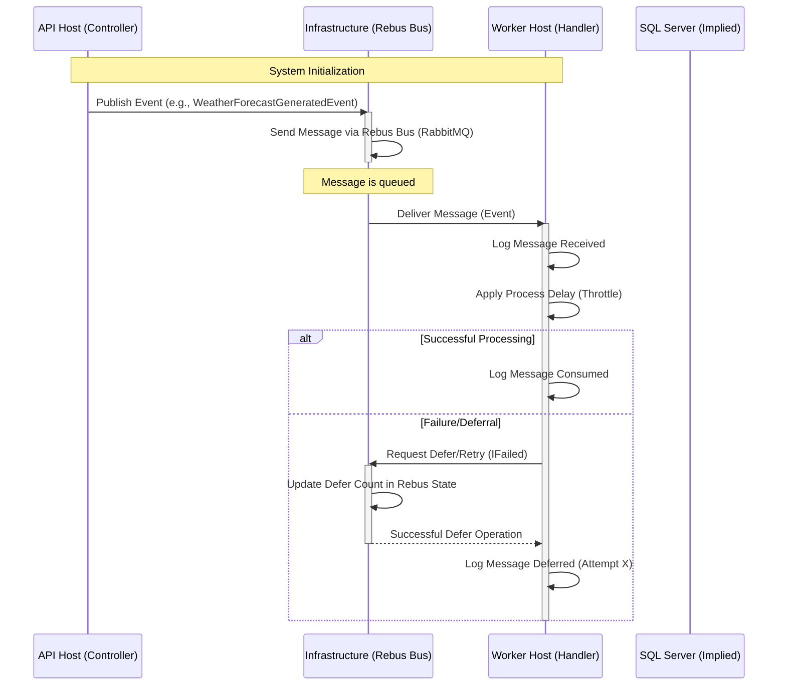

```mermaid
sequenceDiagram
    participant API as API Host (Controller)
    participant INF as Infrastructure (Rebus Bus)
    participant WORKER as Worker Host (Handler)
    participant DB as SQL Server (Implied)

    Note over API, WORKER: System Initialization

    API->>INF: Publish Event (e.g., WeatherForecastGeneratedEvent)
    activate INF
    INF->>INF: Send Message via Rebus Bus (RabbitMQ)
    deactivate INF

    Note over INF: Message is queued

    INF->>WORKER: Deliver Message (Event)
    activate WORKER

    WORKER->>WORKER: Log Message Received
    WORKER->>WORKER: Apply Process Delay (Throttle)

    alt Successful Processing
        WORKER->>WORKER: Log Message Consumed
    else Failure/Deferral
        WORKER->>INF: Request Defer/Retry (IFailed)
        activate INF
        INF->>INF: Update Defer Count in Rebus State
        INF-->>WORKER: Successful Defer Operation
        deactivate INF
        WORKER->>WORKER: Log Message Deferred (Attempt X)
    end

    deactivate WORKER
```
